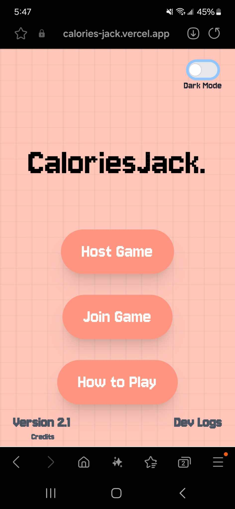
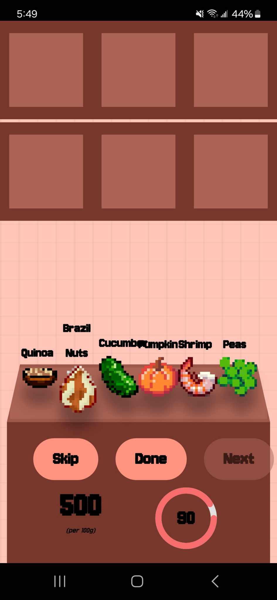
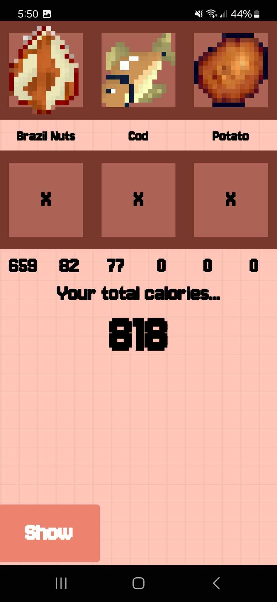
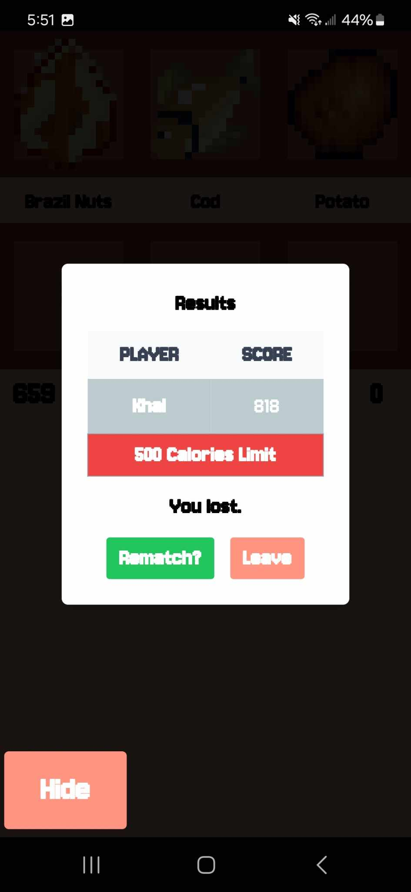
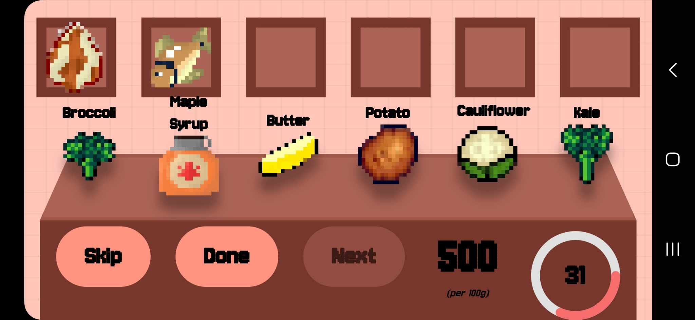

## What is CaloriesJack?
CaloriesJack is a competitive calorie-tracking game challenge where players try to reach a target calories goal without exceeding it. Each player chooses a food item from 6 levels, which is tallied at the end. The player closest to the goal is declared the winner. Game is hosted on Vercel & Render (Frontend & Backend) and uses Supabase for Database (PostgreSQL). The game is also mobile friendly for those who would like to use their phone.

**You are more than welcome to try the [game](https://calories-jack.vercel.app/) live**

### Tech Stack: 
React.js, TailwindCSS, Node.js, Express.js, Supabase

### Hosted on: 
[Vercel](https://vercel.com) (Frontend) & [Render](https://render.com/) (Backend)

## Screenshots of the game:
<div style="display: flex; flex-wrap: wrap;">
  
  
  
  
  
</div>
  


## How to Run Locally

1. Clone the Repository

```
git clone https://github.com/KhaledHadida/CaloriesJack.git 
cd CaloriesJack
```

### `npm start`

Runs the app in the development mode.\
Open [http://localhost:3000](http://localhost:3000) to view it in your browser.

The page will reload when you make changes.\
You may also see any lint errors in the console.
