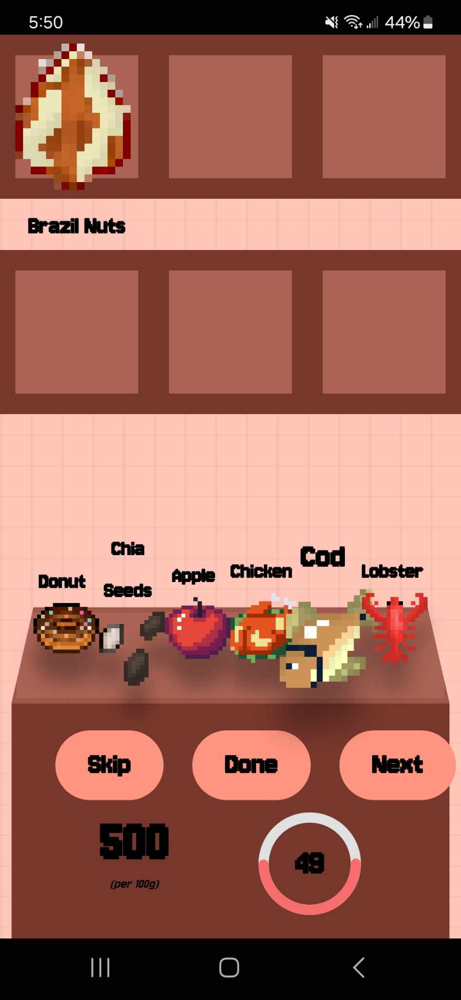

## What is CaloriesJack?
CaloriesJack is a competitive calorie-tracking game challenge where players try to reach a target calories goal without exceeding it. Each player chooses a food item from 6 levels, which is tallied at the end. The player closest to the goal is declared the winner. Game is hosted on Vercel & Render (Frontend & Backend) and uses Supabase for Database (PostgreSQL). The game is also mobile friendly for those who would like to use their phone.

**You are more than welcome to try the [game](https://calories-jack.vercel.app/) live**

### Tech Stack: 
React.js, TailwindCSS, Node.js, Express.js, Supabase

### Hosted on: 
[Vercel](https://vercel.com) (Frontend) & [Render](https://render.com/) (Backend)

## Screenshots of the game:
<div style="display: flex; flex-wrap: wrap;">
  
  
  
  
  
</div>
  


## How to Run Locally

1. Clone the Repository

```
git clone https://github.com/KhaledHadida/CaloriesJack.git 
cd CaloriesJack
```

2. Set up your .env file in src folder with Supabase variables (You will need to create a Supabase project to retrieve [anon key & URL](https://supabase.com/docs/guides/api))

```
REACT_APP_SUPABASE_URL="YOUR URL HERE"
REACT_APP_API_BASE_URL="http://localhost:8080"
REACT_APP_SUPABASE_ANON_KEY="YOUR ANON KEY HERE"
```

3. Install Dependencies & Start the Frontend Development Server

```
npm install
npm start
```

Make sure the [backend](https://github.com/KhaledHadida/CaloriesJack-Backend) is also running.

Open [http://localhost:3000](http://localhost:3000) to view it in your browser.

